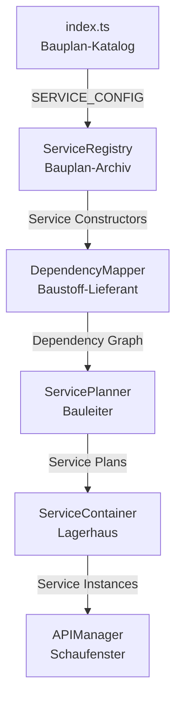

# index.ts - Der Katalog aller Baupläne

## 🏗️ **Metapher: Der Bauplan-Katalog**

Die `src/services/index.ts` Datei ist wie ein **Katalog aller verfügbaren Baupläne** in einem Architekturbüro. Sie enthält alle Service-Klassen, die das System kennt und verwenden kann.

## 📋 **Was ist index.ts?**

```typescript
// Der Katalog aller Baupläne
export const SERVICE_CONFIG = [
  // Cross-Cutting Concerns (Grundbausteine)
  FoundryLogger,
  ConsoleErrorHandler,
  FoundryAdapter,
  NotificationService,
  
  // Core Services (Hauptfunktionen)
  RegistrationService,
  ModuleInitializer,
  ServiceManager,
  ServiceFactory,
  
  // Business Services (Geschäftslogik)
  RelationshipGraphService,
  RelationshipGraphPersistenceService,
  // ... weitere Services
];
```

## 🔄 **Wie funktioniert der Katalog im Bootablauf?**

### **1. ServiceRegistry liest den Katalog**
```typescript
// ServiceRegistry = Bauplan-Archiv
export class ServiceRegistry {
  registerAllServices(): void {
    // Katalog durchgehen und alle Baupläne registrieren
    for (const ServiceClass of SERVICE_CONFIG) {
      this.registerService(ServiceClass, ServiceClass);
    }
  }
}
```

**Metapher:** Das Bauplan-Archiv geht durch den Katalog und kopiert alle Baupläne in sein Archiv.

### **2. DependencyMapper analysiert den Katalog**
```typescript
// DependencyMapper = Baustoff-Lieferant
export class DependencyMapper {
  buildDependencyGraph(): Map<any, any[]> {
    const graph = new Map();
    
    // Für jeden Service im Katalog Dependencies ermitteln
    for (const ServiceClass of SERVICE_CONFIG) {
      const dependencies = this.extractDependencies(ServiceClass);
      graph.set(ServiceClass, dependencies);
    }
    
    return graph;
  }
}
```

**Metapher:** Der Baustoff-Lieferant geht durch den Katalog und erstellt für jeden Bauplan eine Materialliste.

## 📚 **Struktur des Katalogs**

### **Kategorien im Katalog:**

```typescript
export const SERVICE_CONFIG = [
  // 🏗️ Cross-Cutting Concerns (Grundbausteine)
  // Diese Services werden überall gebraucht
  FoundryLogger,           // Logging-System
  ConsoleErrorHandler,     // Fehlerbehandlung
  FoundryAdapter,          // Foundry VTT API
  NotificationService,     // Benachrichtigungen
  
  // 🔧 Core Services (Hauptfunktionen)
  // Diese Services sind das Herz des Systems
  RegistrationService,     // Service-Registrierung
  ModuleInitializer,      // Modul-Initialisierung
  ServiceManager,         // Service-Container
  ServiceFactory,         // Service-Registry
  
  // 🎨 Svelte & UI Services (Benutzeroberfläche)
  SvelteManager,          // Svelte-Komponenten
  CSSManager,             // Styling
  ServiceLocator,         // Service-Auffindung
  
  // 🌐 API & Registration Services (Externe Schnittstellen)
  APIRegistrationService, // API-Registrierung
  CrossCuttingServiceManager, // Cross-Cutting Services
  ServiceRegistrationManager, // Service-Registrierung
  
  // 💼 Business Services (Geschäftslogik)
  // Diese Services implementieren die Hauptfunktionen
  RelationshipGraphService,           // Beziehungsgraph
  RelationshipGraphPersistenceService, // Datenpersistierung
  RelationshipGraphDemoDataService,   // Demo-Daten
  // ... weitere Business Services
];
```

## 🔍 **Warum ist der Katalog wichtig?**

### **1. Zentrale Verwaltung**
- Alle Services an einem Ort
- Einfach neue Services hinzufügen
- Übersicht über verfügbare Services

### **2. Automatische Registrierung**
```typescript
// ServiceRegistry kann automatisch alle Services registrieren
serviceRegistry.registerAllServices(SERVICE_CONFIG);
// → Alle Services aus dem Katalog werden registriert
```

### **3. Dependency Resolution**
```typescript
// DependencyMapper kann alle Services analysieren
const dependencyGraph = dependencyMapper.buildDependencyGraph(SERVICE_CONFIG);
// → Dependency Graph für alle Services im Katalog
```

## 📝 **Wie fügt man neue Services hinzu?**

### **Schritt 1: Service-Klasse erstellen**
```typescript
// src/services/MyNewService.ts
export class MyNewService {
  static readonly API_NAME = "myNewService";
  static readonly SERVICE_TYPE = "singleton" as const;
  
  constructor(
    @Inject(FoundryLogger) private logger: ILogger
  ) {}
}
```

### **Schritt 2: In den Katalog aufnehmen**
```typescript
// src/services/index.ts
export const SERVICE_CONFIG = [
  // ... bestehende Services
  MyNewService,  // ← Neuen Service hinzufügen
];
```

### **Schritt 3: Export hinzufügen**
```typescript
// src/services/index.ts
import { MyNewService } from "./MyNewService";
export { MyNewService } from "./MyNewService";
```

## 🎯 **Zusammenfassung der Metapher**

| Element | Metapher | Was es macht |
|---------|----------|--------------|
| **index.ts** | Bauplan-Katalog | Enthält alle verfügbaren Service-Klassen |
| **SERVICE_CONFIG** | Katalog-Index | Array mit allen Service-Klassen |
| **ServiceRegistry** | Bauplan-Archiv | Kopiert Baupläne aus dem Katalog |
| **DependencyMapper** | Baustoff-Lieferant | Analysiert Katalog und erstellt Materiallisten |

## 🔄 **Der komplette Ablauf mit dem Katalog**



**Deine Analogie war perfekt:** `index.ts` ist tatsächlich der Katalog aller Baupläne! 📚

Der Katalog ist das zentrale Verzeichnis, aus dem alle anderen Komponenten ihre Informationen beziehen. Ohne den Katalog wüsste das System nicht, welche Services verfügbar sind.
