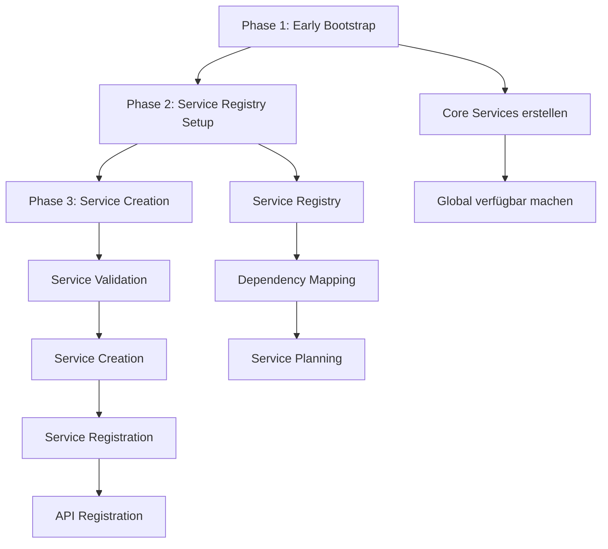
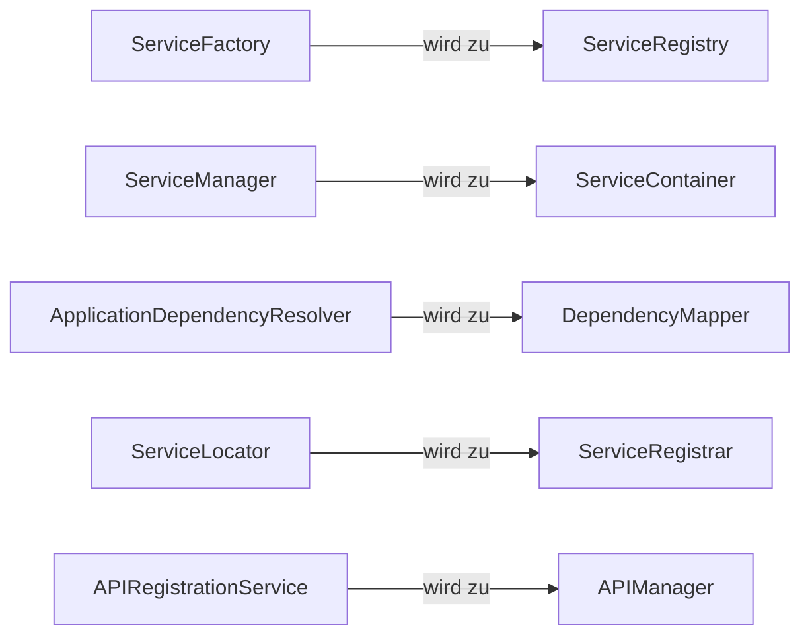
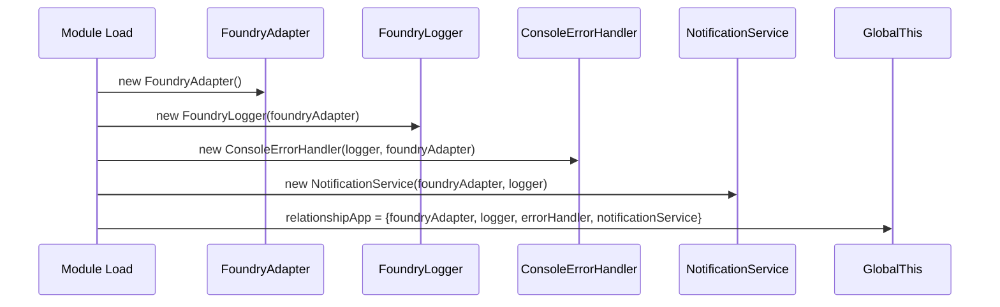
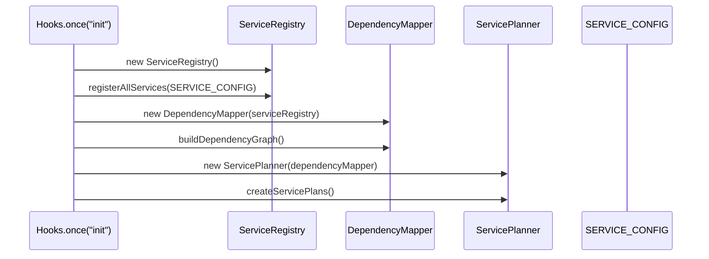
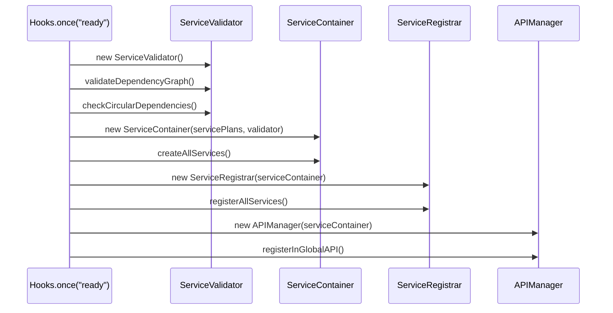

# SOLID-konformer Bootablauf - Vollständige Übersicht

## 🎯 **Übersicht**

Dieses Dokument beschreibt den vollständigen SOLID-konformen Bootablauf des Relationship App Moduls. Jeder Schritt hat eine klare Verantwortlichkeit und keine zirkulären Abhängigkeiten.

## 🔄 **Bootablauf-Phasen**

### **Phase 1: Early Bootstrap**
Kritische Services ohne DI erstellen (zirkuläres Problem umgehen)

### **Phase 2: Service Registry Setup** 
Service-Klassen erfassen, Dependencies mappen und Baupläne erstellen

### **Phase 3: Service Creation**
Services validieren, erstellen, registrieren und in API verfügbar machen

## 📊 **Gesamtübersicht des Bootablaufs**



## 🏗️ **Klassenarchitektur**

### **Neue Klassen (zu erstellen)**

```mermaid
graph TD
    A[ServiceRegistry] -->|Service Constructors| B[DependencyMapper]
    B -->|Dependency Graph| C[ServicePlanner]
    C -->|Service Plans| D[ServiceValidator]
    D -->|Validated Plans| E[ServiceContainer]
    E -->|Service Instances| F[ServiceRegistrar]
    F -->|Registered Services| G[APIManager]
    
    H[Service Classes] -->|@Inject Decorators| B
    I[Client Code] -->|Service Access| E
    J[External Modules] -->|API Access| G
```

### **Bestehende Klassen (umzubauen)**



## 📋 **Detaillierter Bootablauf**

### **Phase 1: Early Bootstrap**



**Zweck:** Kritische Services ohne DI erstellen (zirkuläres Problem umgehen)

**Benötigte Klassen:**
- `FoundryAdapter` ✅ (bereits vorhanden)
- `FoundryLogger` ✅ (bereits vorhanden) 
- `ConsoleErrorHandler` ✅ (bereits vorhanden)
- `NotificationService` ✅ (bereits vorhanden)

### **Phase 2: Service Registry Setup**



**Schritt 2: Service Registry initialisieren**
- **Zweck:** Alle Service-Klassen erfassen und registrieren
- **Klasse:** `ServiceRegistry` (ServiceFactory umbauen)

**Schritt 3: Dependency Mapping**
- **Zweck:** Dependencies aus @Inject extrahieren und mappen
- **Klasse:** `DependencyMapper` (ApplicationDependencyResolver umbauen)

**Schritt 4: Service Baupläne erstellen**
- **Zweck:** Service Registration Objects mit Dependencies
- **Klasse:** `ServicePlanner` (Teil von ServiceManager extrahieren)

### **Phase 3: Service Creation**



**Schritt 5: Service Validierung**
- **Zweck:** Service-Erstellung validieren und Fehler prüfen
- **Klasse:** `ServiceValidator` (neu erstellen)

**Schritt 6: Service Creation**
- **Zweck:** Services mit Dependencies erstellen
- **Klasse:** `ServiceContainer` (ServiceManager umbauen)

**Schritt 7: Service Registration**
- **Zweck:** Services registrieren und verfügbar machen
- **Klasse:** `ServiceRegistrar` (ServiceLocator umbauen)

**Schritt 8: API Registration**
- **Zweck:** Services in globaler API verfügbar machen
- **Klasse:** `APIManager` (APIRegistrationService umbauen)

## 🔧 **Klassenrollen und Verantwortlichkeiten**

### **ServiceRegistry (ServiceFactory umbauen)**
```typescript
export class ServiceRegistry {
  // NUR Registry-Funktionen
  registerService(identifier: any, constructor: any): void
  getServiceConstructor(identifier: any): any
  hasService(identifier: any): boolean
  getRegisteredServices(): any[]
  
  // KEINE createService() - das macht ServiceContainer
}
```

**Verantwortlichkeit:** Service-Klassen erfassen und registrieren

### **DependencyMapper (ApplicationDependencyResolver umbauen)**
```typescript
export class DependencyMapper {
  // Dependencies aus @Inject extrahieren
  extractDependencies(serviceClass: any): any[]
  
  // Hardcoded Dependencies als Fallback
  getHardcodedDependencies(serviceClass: any): any[]
  
  // Dependency Graph erstellen
  buildDependencyGraph(services: any[]): Map<any, any[]>
}
```

**Verantwortlichkeit:** Dependencies aus @Inject extrahieren und mappen

### **ServicePlanner (Teil von ServiceManager extrahieren)**
```typescript
export class ServicePlanner {
  // Service Baupläne mit Dependencies erstellen
  createServicePlans(): Map<any, ServicePlan>
  
  // Dependency Resolution Plan erstellen
  createResolutionPlan(dependencyGraph: Map<any, any[]>): ResolutionPlan
}
```

**Verantwortlichkeit:** Service Baupläne mit Dependencies erstellen

### **ServiceValidator (neu erstellen)**
```typescript
export class ServiceValidator {
  // Service-Erstellung validieren
  validateServiceCreation(service: any, identifier: any): boolean
  
  // Zirkuläre Dependencies prüfen
  checkCircularDependencies(dependencyGraph: Map<any, any[]>): boolean
  
  // Alle Services validieren
  validateAllServices(serviceContainer: ServiceContainer): ValidationResult
}
```

**Verantwortlichkeit:** Service-Erstellung validieren und Fehler prüfen

### **ServiceContainer (ServiceManager umbauen)**
```typescript
export class ServiceContainer {
  // Services mit Dependencies erstellen
  createService<T>(identifier: any): T
  
  // Dependencies rekursiv auflösen
  resolveDependencies(servicePlan: ServicePlan): any[]
  
  // Singleton-Instanzen cachen
  cacheSingleton(identifier: any, instance: any): void
}
```

**Verantwortlichkeit:** Services mit Dependencies erstellen

### **ServiceRegistrar (ServiceLocator umbauen)**
```typescript
export class ServiceRegistrar {
  // Services in ServiceContainer registrieren
  registerServices(serviceContainer: ServiceContainer, services: any[]): void
  
  // Service Discovery ermöglichen
  registerServiceLocator(serviceLocator: ServiceLocator): void
}
```

**Verantwortlichkeit:** Services registrieren und verfügbar machen

### **APIManager (APIRegistrationService umbauen)**
```typescript
export class APIManager {
  // Services in globaler API registrieren
  registerInGlobalAPI(): void
  
  // API Metadaten generieren
  generateAPIMetadata(): APIMetadata
}
```

**Verantwortlichkeit:** Services in globaler API verfügbar machen

## 🔄 **Datenfluss zwischen den Klassen**

```mermaid
graph TD
    A[Service Classes] -->|@Inject Decorators| B[DependencyMapper]
    C[SERVICE_CONFIG] -->|Service Constructors| D[ServiceRegistry]
    D -->|Service Constructors| B
    B -->|Dependency Graph| E[ServicePlanner]
    E -->|Service Plans| F[ServiceValidator]
    F -->|Validated Plans| G[ServiceContainer]
    G -->|Service Instances| H[ServiceRegistrar]
    H -->|Registered Services| I[APIManager]
    I -->|Global API| J[External Access]
    
    K[Client Code] -->|Service Access| G
    L[Early Bootstrap] -->|Core Services| G
```

## ✅ **Vorteile dieser Architektur**

1. **Keine zirkulären Abhängigkeiten** - Klare Trennung der Verantwortlichkeiten
2. **SOLID-konform** - Jede Klasse hat eine einzige Verantwortlichkeit
3. **Testbar** - Jede Klasse kann isoliert getestet werden
4. **Erweiterbar** - Neue Services können einfach hinzugefügt werden
5. **Wartbar** - Klare Struktur und Abhängigkeiten

## 🚀 **Implementierungsreihenfolge**

1. **ServiceRegistry** erstellen (ServiceFactory umbauen)
2. **DependencyMapper** erstellen (ApplicationDependencyResolver umbauen)
3. **ServicePlanner** erstellen (Teil von ServiceManager extrahieren)
4. **ServiceValidator** erstellen (neu)
5. **ServiceContainer** erstellen (ServiceManager umbauen)
6. **ServiceRegistrar** erstellen (ServiceLocator umbauen)
7. **APIManager** erstellen (APIRegistrationService umbauen)
8. **Bootablauf** in init.ts anpassen

## 📝 **Nächste Schritte**

1. Bestehende Klassen analysieren und refaktorieren
2. Neue Klassen implementieren
3. Bootablauf in init.ts anpassen
4. Tests für jede Klasse schreiben
5. Integration testen
