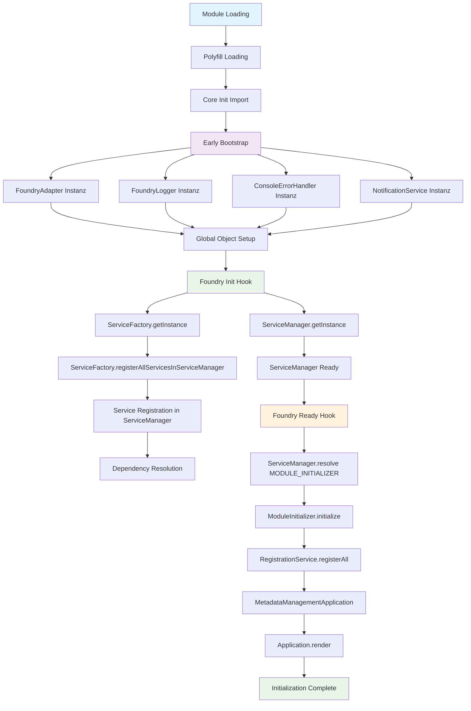

# Modul Bootprozess - Relationship App

## Übersicht

Dieses Dokument beschreibt den detaillierten Bootprozess des Relationship App Moduls in Foundry VTT. Der Prozess folgt dem SOLID-Prinzip und verwendet ein Dependency Injection System mit ServiceManager und ServiceFactory.

## Bootsequenz

### Phase 1: Module Loading (Sofort beim Laden)

```typescript
// src/index.ts
import "./polyfills/cytoscape-assign-fix";
import "./core/init";
```

1. **Polyfill Loading**: Cytoscape-Assign-Fix wird geladen
2. **Core Init**: `src/core/init.ts` wird ausgeführt

### Phase 2: Early Bootstrap (Sofort nach Import)

```typescript
// src/core/init.ts - Zeilen 14-25
const foundryAdapter = new FoundryAdapter();
const logger = new FoundryLogger(foundryAdapter);
const errorHandler = new ConsoleErrorHandler(logger, foundryAdapter);
const notificationService = new NotificationService(foundryAdapter, logger);

// Global verfügbar machen
(globalThis as any).relationshipApp = {
  foundryAdapter,
  logger,
  errorHandler,
  notificationService,
};
```

**Instanziierte Klassen:**
- `FoundryAdapter` - Foundry VTT API Wrapper
- `FoundryLogger` - Logging Service
- `ConsoleErrorHandler` - Error Handling
- `NotificationService` - UI Notifications

### Phase 3: Foundry Init Hook

```typescript
// src/core/init.ts - Zeilen 27-41
foundryAdapter.onInit(() => {
  logger.info("🚀 Relationship App: Initializing ServiceManager...");

  // ServiceFactory und ServiceManager erstellen
  const serviceFactory = ServiceFactory.getInstance();
  const serviceManager = ServiceManager.getInstance();

  // ServiceFactory automatisch alle Services im ServiceManager registrieren lassen
  serviceFactory.registerAllServicesInServiceManager(serviceManager);

  // ServiceManager zu globalen Services hinzufügen
  (globalThis as any).relationshipApp.serviceManager = serviceManager;

  logger.info("✅ Relationship App: ServiceManager ready!");
});
```

**Instanziierte Klassen:**
- `ServiceFactory` (Singleton)
- `ServiceManager` (Singleton)

**ServiceFactory.registerAllServicesInServiceManager():**
- Registriert alle Services automatisch im ServiceManager
- Bestimmt Dependencies automatisch über `getServiceDependencies()`
- Verwendet `registerWithMetadata()` für Dependency Injection

### Phase 4: Foundry Ready Hook

```typescript
// src/core/init.ts - Zeilen 44-67
foundryAdapter.onReady(async () => {
  const { serviceManager, logger, errorHandler, notificationService } = (globalThis as any)
    .relationshipApp;

  try {
    // ModuleInitializer über ServiceManager auflösen
    const moduleInitializer = serviceManager.resolve(SERVICE_IDENTIFIERS.MODULE_INITIALIZER);

    // Initialisierung starten
    await moduleInitializer.initialize();

    // Metadata Management Application (noch nicht SOLID - wird später refactored)
    const metadataManagementApplication = new MetadataManagementApplication();
    metadataManagementApplication.render({ force: true });

    logger.info("✅ Relationship App: Fully SOLID initialization completed!");
    notificationService.showSuccess("Relationship App initialized successfully!");
  } catch (error) {
    errorHandler.handle(error, "Module initialization");
    notificationService.showError(
      "Relationship App initialization failed. Check console for details."
    );
  }
});
```

**Instanziierte Klassen:**
- `ModuleInitializer` (über ServiceManager.resolve())
- `MetadataManagementApplication` (direkt instanziiert)

## ServiceFactory Details

### Service Registration

Die `ServiceFactory` registriert alle Services in `registerDefaultServices()`:

```typescript
// Cross-Cutting Services (bereits global verfügbar)
this.registerService(SERVICE_IDENTIFIERS.FOUNDRY_LOGGER, LoggerFactory);
this.registerService(SERVICE_IDENTIFIERS.CONSOLE_ERROR_HANDLER, ErrorHandlerFactory);
this.registerService(SERVICE_IDENTIFIERS.FOUNDRY_ADAPTER, FoundryAdapterFactory);
this.registerService(SERVICE_IDENTIFIERS.NOTIFICATION, NotificationServiceFactory);

// Core Services
this.registerService(SERVICE_IDENTIFIERS.REGISTRATION_SERVICE, RegistrationService);
this.registerService(SERVICE_IDENTIFIERS.MODULE_INITIALIZER, ModuleInitializer);

// Business Services
this.registerService(SERVICE_IDENTIFIERS.RELATIONSHIP_GRAPH, RelationshipGraphService);
// ... weitere Services
```

### Dependency Resolution

Die `ServiceFactory` bestimmt Dependencies automatisch über `getServiceDependencies()`:

```typescript
private getServiceDependencies(identifier: string): string[] {
  const dependencyMap: Record<string, string[]> = {
    [SERVICE_IDENTIFIERS.MODULE_INITIALIZER]: [
      SERVICE_IDENTIFIERS.FOUNDRY_LOGGER,
      SERVICE_IDENTIFIERS.CONSOLE_ERROR_HANDLER,
      SERVICE_IDENTIFIERS.REGISTRATION_SERVICE,
    ],
    [SERVICE_IDENTIFIERS.RELATIONSHIP_GRAPH]: [
      SERVICE_IDENTIFIERS.FOUNDRY_LOGGER,
      SERVICE_IDENTIFIERS.CONSOLE_ERROR_HANDLER,
      SERVICE_IDENTIFIERS.RELATIONSHIP_GRAPH_PERSISTENCE,
      // ... weitere Dependencies
    ],
    // ... weitere Services
  };
  return dependencyMap[identifier] || [];
}
```

## ServiceManager Details

### Service Resolution

Der `ServiceManager` löst Services über `resolve()` auf:

```typescript
resolve<T>(identifier: string): T {
  // Return existing instance if singleton
  if (this.instances.has(identifier)) {
    return this.instances.get(identifier);
  }

  const registration = this.serviceRegistry.get(identifier);
  if (!registration) {
    throw new Error(`Service '${identifier}' is not registered`);
  }

  // Resolve dependencies first
  const resolvedDependencies = registration.dependencies.map((dep: string) => this.resolve(dep));

  // Create instance with resolved dependencies
  const instance = registration.factory(...resolvedDependencies);

  // Cache if singleton
  if (registration.singleton) {
    this.instances.set(identifier, instance);
  }

  return instance;
}
```

### Service Registration

Services werden mit Metadaten registriert:

```typescript
registerWithMetadata<T>(
  identifier: string,
  ServiceConstructor: new (...args: any[]) => T,
  dependencies: string[] = []
): void {
  const metadata = ServiceConstructor as any;

  this.register(
    identifier,
    () => {
      const args = dependencies.map((dep) => this.resolve(dep));
      return new ServiceConstructor(...args);
    },
    metadata.SERVICE_TYPE === "singleton",
    dependencies
  );
}
```

## ModuleInitializer Details

Der `ModuleInitializer` führt die finale Initialisierung durch:

```typescript
async initialize(): Promise<void> {
  try {
    this.logger.info("🚀 Relationship App: Starting initialization...");

    // Register all Foundry integrations
    await this.registrationService.registerAll();

    this.logger.info("✅ Relationship App: Initialization completed!");
  } catch (error) {
    this.errorHandler.handle(error, "Module initialization");
    throw error;
  }
}
```

## Mermaid Diagramm



## Wichtige Design-Prinzipien

### 1. SOLID Prinzipien
- **Single Responsibility**: Jede Klasse hat eine klare Verantwortung
- **Open/Closed**: Services können erweitert werden ohne Änderung
- **Liskov Substitution**: Interfaces ermöglichen Austauschbarkeit
- **Interface Segregation**: Kleine, spezifische Interfaces
- **Dependency Inversion**: Abhängigkeiten von Interfaces, nicht Implementierungen

### 2. Dependency Injection
- Services werden über ServiceManager aufgelöst
- Dependencies werden automatisch injiziert
- Singleton Pattern für zentrale Services
- Factory Pattern für komplexe Objekterstellung

### 3. Service Lifecycle
- **Early Bootstrap**: Kritische Services sofort verfügbar
- **Init Phase**: ServiceManager und ServiceFactory Setup
- **Ready Phase**: Vollständige Initialisierung und Anwendungsstart

### 4. Error Handling
- Zentraler ErrorHandler für alle Services
- Graceful Degradation bei Fehlern
- Logging auf allen Ebenen

## Fazit

Der Bootprozess folgt einem klaren, schrittweisen Ansatz:
1. **Sofortige Verfügbarkeit** kritischer Services
2. **Strukturierte Registrierung** aller Services
3. **Automatische Dependency Resolution**
4. **Vollständige Initialisierung** nach Foundry Ready

Dies gewährleistet eine robuste, wartbare und erweiterbare Architektur, die den SOLID-Prinzipien folgt.
