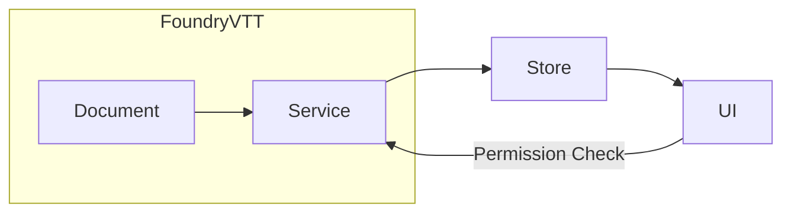
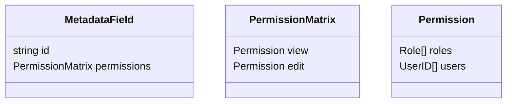
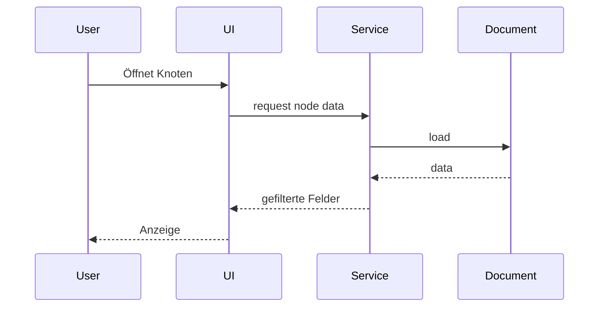

# Feingranulares Berechtigungssystem für Metadaten

## 1. Zielsetzung
Dieses Konzept beschreibt ein Berechtigungssystem, mit dem Metadatenfelder von Knoten und Kanten in der Relationship App bis auf Feldebene für bestimmte Benutzer sichtbar oder bearbeitbar gemacht werden können.

## 2. Architekturüberblick

- **Service**: prüft Berechtigungen beim Laden/Speichern.
- **Store**: hält nur erlaubte Felder.
- **UI**: zeigt/hide Felder je nach Berechtigung.

## 3. Berechtigungsmodell
- Rollenbasiertes Modell (`PLAYER`, `TRUSTED`, `GM`).
- Benutzerbezogene Overrides.
- Rechte-Matrix pro Feld: `view` / `edit`.

### 3.1 Matrix-Beispiel
```json
{
  "name": {
    "view": {"roles": ["PLAYER"], "users": []},
    "edit": {"roles": ["GM"], "users": ["user-123"]}
  }
}
```

## 4. Datenmodell-Erweiterungen

- JSON-Schemas erhalten optionales `permissions`-Attribut.
- Speicherung innerhalb Foundry Documents.

## 5. Zugriffskontrolle
1. **Beim Laden**: Service filtert Felder ohne `view`-Recht.
2. **Beim Speichern**: Service validiert `edit`-Rechte.
3. **Hooks**: `permission-denied` für UI-Feedback.

## 6. UI/UX Integration
### 6.1 Metadaten-Editor
- Zusätzlicher Tab "Berechtigungen".
- Matrix-Widget pro Feld.

### 6.2 Datenanzeige
- Felder ohne `view`: ausgeblendet.
- Felder mit `view` aber ohne `edit`: read-only.

## 7. Beispielablauf


## 8. Audit & Logging
- Jeder Zugriff ohne Berechtigung wird geloggt.
- Optionaler Report über fehlgeschlagene Zugriffe.

## 9. Integration in das Gesamtsystem
- Services orientieren sich am bestehenden ServiceFactory-Pattern.
- Store bleibt Single Source of Truth.
- UI nutzt bestehende Svelte-Komponenten.

## 10. Migration & Defaults
- Standard: alle Felder sichtbar, nur `GM` editierbar.
- Migrationsskript setzt Default-Matrix.

## 11. Offene Punkte
- Performance bei großen Benutzerlisten.
- UI-Design für komplexe Matrizen.
- Synchronisation mit Foundry Permission Core.

